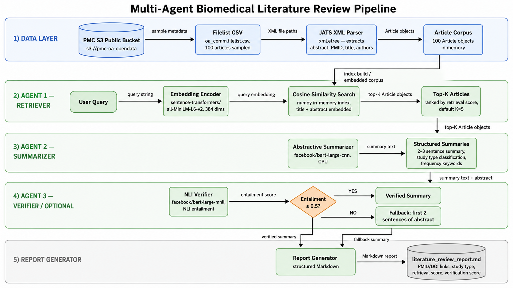

# Biomedical Literature Review Pipeline

[](LICENSE)
[](https://www.python.org)
[](https://github.com/psf/black)
[](https://pre-commit.com/)
[](https://github.com/javadfarshchi/multi-agent-lit-review/actions)

A three-agent NLP pipeline that retrieves, summarizes, and fact-checks biomedical research articles from PubMed Central Open Access. Built as an AI engineering portfolio case study.

Given a natural-language query such as *"Adverse events with mRNA vaccines in pediatrics"*, the pipeline:
1. Retrieves the most semantically relevant articles from a 100-article PMC corpus using dense embeddings
2. Produces a 2-3 sentence abstractive summary of each article's abstract
3. Verifies each summary for factual consistency against its source abstract using NLI entailment

No cloud credentials, no GPU, and no proprietary data are required. Everything runs on CPU from a single Jupyter notebook.

---

## Pipeline Architecture



The pipeline has five stages:

1. **Data Layer** -- PMC S3 public bucket sampled via filelist CSV, parsed with JATS XML parser into 100 in-memory `Article` objects with two-layer retraction filtering
2. **Retriever Agent** -- query string embedded with `sentence-transformers/all-MiniLM-L6-v2` (384 dims), ranked against corpus by cosine similarity, returns top-K articles
3. **Summarizer Agent** -- `facebook/bart-large-cnn` produces a 2-3 sentence abstractive summary per article; frequency-based keyword extraction and rule-based study type classification added
4. **Verifier Agent** -- `facebook/bart-large-mnli` NLI entailment check; summaries scoring below 0.5 fall back to the first two sentences of the source abstract
5. **Report Generator** -- structured Markdown report with PMID/DOI links, retrieval score, verification score, and keywords per article

---

## Key Design Decisions

| Decision | Choice | Rationale |
|---|---|---|
| Embedding model | `all-MiniLM-L6-v2` | 384-dim, 256-token, CPU-friendly, ~90 MB |
| Summarization model | `facebook/bart-large-cnn` | Fine-tuned on CNN/DailyMail; `bart-base` is not fine-tuned for summarization and produces incoherent output |
| Verification method | NLI entailment (`bart-large-mnli`) | Directly models premise-hypothesis consistency; more principled than ROUGE/BLEU for detecting factual drift |
| Retraction filtering | Two layers: filelist column + title-prefix guard | Filelist `Retracted` column is sometimes stale; title guard catches papers the column misses |
| S3 paths | `deprecated/oa_comm/xml/...` prefix | PMC migrated paths April 2026; original paths from the assignment PDF no longer exist |

---

## Repository Structure

```
multi-agent-lit-review/
|
|- notebook.ipynb                   Main deliverable -- 5 sections
|
|- requirements.txt                 Runtime dependencies (pinned)
|- requirements-dev.txt             Dev tooling (linting, testing, nbstripout)
|- pyproject.toml                   Tool configuration (black, isort, ruff)
|- Makefile                         Common tasks: install, lint, strip-outputs
|- .pre-commit-config.yaml          Automated code hygiene
|-
|- data/
|   |- raw/                         Populated at runtime from PMC S3 (not committed)
|   `- processed/                   Populated at runtime (not committed)
|-
|- outputs/                         Generated at runtime (not committed)
|   |- literature_review_report.md  Markdown report for all 3 queries
|   `- pipeline_results.json        Structured JSON with all results
|-
|- docs/
|   `- assets/                      Diagrams and static assets for README
|-
|- .github/
|   |- workflows/ci.yml             GitHub Actions: lint + nbstripout verification
|   `- ISSUE_TEMPLATE/              Bug report and question templates
|-
|- CONTRIBUTING.md
|- CITATION.cff
|- LICENSE
`- .env.example
```

---

## Quick Start

### Prerequisites

- Python 3.10 or later
- Internet access (PMC S3 bucket and HuggingFace model downloads)
- Approximately 3.5 GB disk space for model downloads on first run
- No AWS credentials required (PMC bucket is public)

### Installation

```bash
git clone https://github.com/javadfarshchi/multi-agent-lit-review
cd multi-agent-lit-review

python -m venv .venv
source .venv/bin/activate      # Linux / macOS
# .venv\Scripts\activate       # Windows

pip install -r requirements.txt
```

### Run the Notebook

```bash
jupyter notebook notebook.ipynb
```

Run all cells in order. Model downloads happen automatically on first run:

| Model | Size | Purpose |
|---|---|---|
| `sentence-transformers/all-MiniLM-L6-v2` | ~90 MB | Article and query embeddings |
| `facebook/bart-large-cnn` | ~1.6 GB | Abstractive summarization |
| `facebook/bart-large-mnli` | ~1.6 GB | NLI-based summary verification |

### Development Setup

```bash
pip install -r requirements.txt -r requirements-dev.txt
pre-commit install
nbstripout --install   # strips notebook outputs on git add automatically
```

Run all linting checks:

```bash
make lint
```

---

## Notebook Sections

| Section | Description | Key Output |
|---|---|---|
| 1 -- Setup and Data Access | Imports, S3 client, Article dataclass, JATS XML parser, filelist loading, article fetch with two-layer retraction filter | 100-article corpus |
| 2 -- Retriever Agent | Embedding model, corpus index (384-dim), `RetrieverAgent` class with optional synonym expansion | Top-K articles per query |
| 3 -- Summarizer Agent | `facebook/bart-large-cnn`, keyword extractor, study type classifier, `SummarizerAgent` class | Article summaries + keywords |
| 4 -- Verifier Agent | `facebook/bart-large-mnli`, NLI zero-shot pipeline, `VerifierAgent` class with pass/fallback logic | Entailment scores + flags |
| 5 -- Report Generation | Full pipeline runner for all 3 queries, results DataFrame, Markdown/JSON report generation | `literature_review_report.md`, `pipeline_results.json` |

---

## Test Queries

The notebook runs the full pipeline against three queries from the case study specification:

1. *Adverse events with mRNA vaccines in pediatrics*
2. *Transformer-based models for protein folding*
3. *Clinical trial outcomes for monoclonal antibodies in oncology*

---

## Understanding the Output Scores

### Why retrieval scores appear low on a random PMC sample

Retrieval scores (cosine similarity, range 0-1) will typically fall in the 0.2-0.5 range when running against a random 100-article PMC sample, and the returned articles may not be topically relevant to the test queries. **This is expected and is a corpus limitation, not a pipeline defect.**

The 100 articles are sampled from the head of the PMC OA commercial filelist, which is ordered by accession ID and covers all biomedical topics indiscriminately. The probability that a random 100-article sample contains papers matching specific queries about mRNA vaccines, protein folding, or monoclonal antibody oncology trials is low.

The retrieval system is operating correctly: scores accurately reflect how closely each article in the corpus matches the query. In a production system, this is addressed by:

- Filtering the filelist by MeSH term before sampling (PMC E-utilities API: `esearch.fcgi?db=pmc&term=mRNA+vaccine[MeSH]`)
- Using a topic-filtered bulk PMC download
- Increasing corpus size to 10,000+ articles, where relevant papers are virtually guaranteed to appear

### Why verification scores are uniformly high

Verification scores (NLI entailment, range 0-1) measure **whether the summary is faithfully supported by the source abstract** -- not whether the article is relevant to the query.

Because the summarizer generates each summary directly from the article's abstract, the summary is structurally very likely to be entailed by that abstract. Scores near 1.0 across all articles are the correct and expected behavior. A low score (triggering the fallback) indicates that the model generated a summary that contradicts or drifts from the source text -- which is the specific anomaly the `VerifierAgent` is designed to detect.

---

## Limitations

- The 256-token limit of `all-MiniLM-L6-v2` truncates long abstracts at embedding time; a longer-context model would improve recall on papers with dense abstracts
- `bart-large-cnn` is trained on news text, not biomedical literature; domain-adapted models (e.g., `allenai/led-base-16384`) would improve summary quality on technical scientific text
- `bart-large-mnli` is a general-domain NLI model; a biomedical NLI model would improve verification precision on medical claims
- Study type classification is rule-based and may misclassify edge cases; zero-shot classification would be more robust
- No evaluation against a labeled biomedical benchmark (e.g., BioASQ, TREC-COVID); see Production Extension Path

---

## Production Extension Path

For a production system on AWS Bedrock:

- Replace `all-MiniLM-L6-v2` with **Amazon Titan Embeddings v2** (1024 dims)
- Replace `bart-large-cnn` with **Claude Haiku 3** via Bedrock (structured JSON output prompt)
- Replace cosine similarity index with **Amazon Bedrock Knowledge Bases + S3 Vectors**
- Replace notebook agents with **Bedrock Agents** (Supervisor + Retriever + Summarizer + Verifier roles)
- Replace `bart-large-mnli` verification with a **factual grounding call** via Bedrock Guardrails
- Add MeSH-term pre-filtering via PubMed E-utilities API for targeted corpus construction
- Add CI/CD pipeline with versioned ingestion, reproducibility tracking, and deterministic validation

---

## Data Source

Articles are fetched at runtime from the **PubMed Central Open Access Commercial subset** via public S3:

- **Bucket:** `s3://pmc-oa-opendata` (us-east-1, anonymous access, no credentials required)
- **Filelist:** `deprecated/oa_comm/xml/metadata/csv/oa_comm.filelist.csv`
- **Articles:** `deprecated/oa_comm/xml/all/{PMCID}.xml` (JATS XML format)

PMC migrated to the `deprecated/` path prefix on April 13, 2026. These paths remain active until August 2026. The assignment PDF references the pre-migration paths which no longer exist at those locations.

---

## Citation

If you use this code or methodology in your own work, please cite it using the GitHub "Cite this repository" button (powered by [`CITATION.cff`](CITATION.cff)).

---

## License

[MIT](LICENSE) -- free to use, modify, and distribute with attribution.
